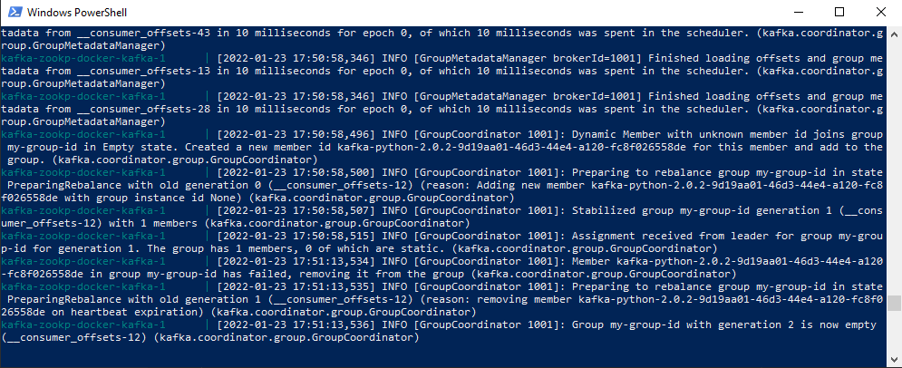
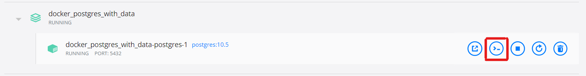
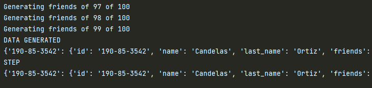
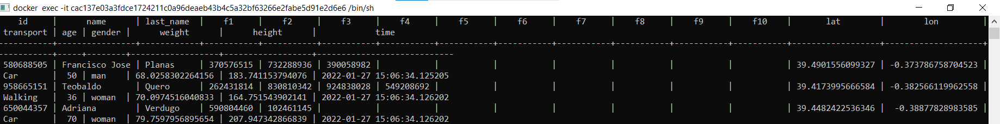
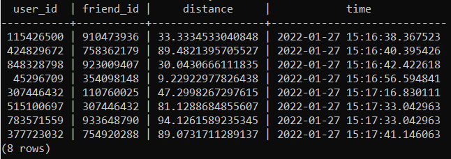
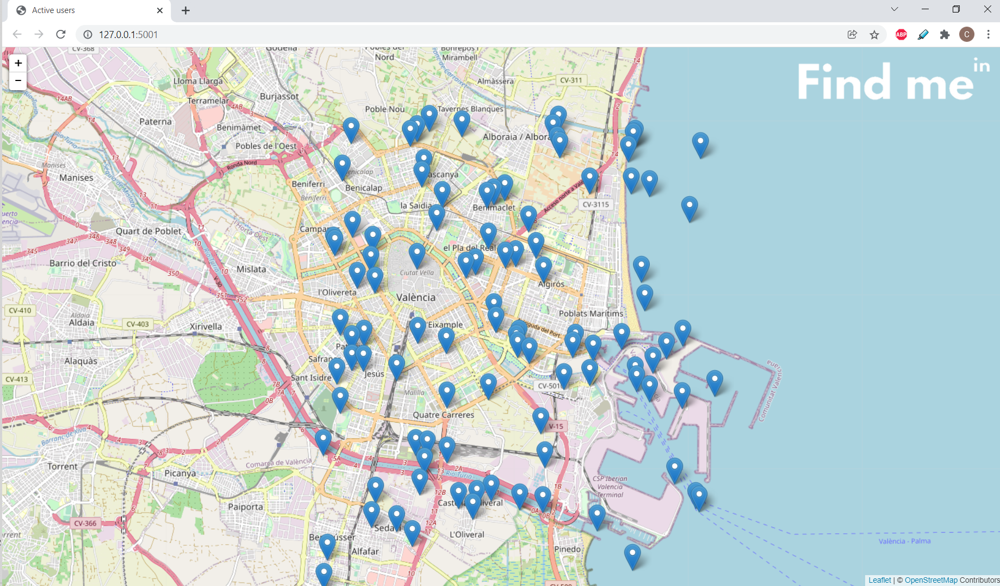
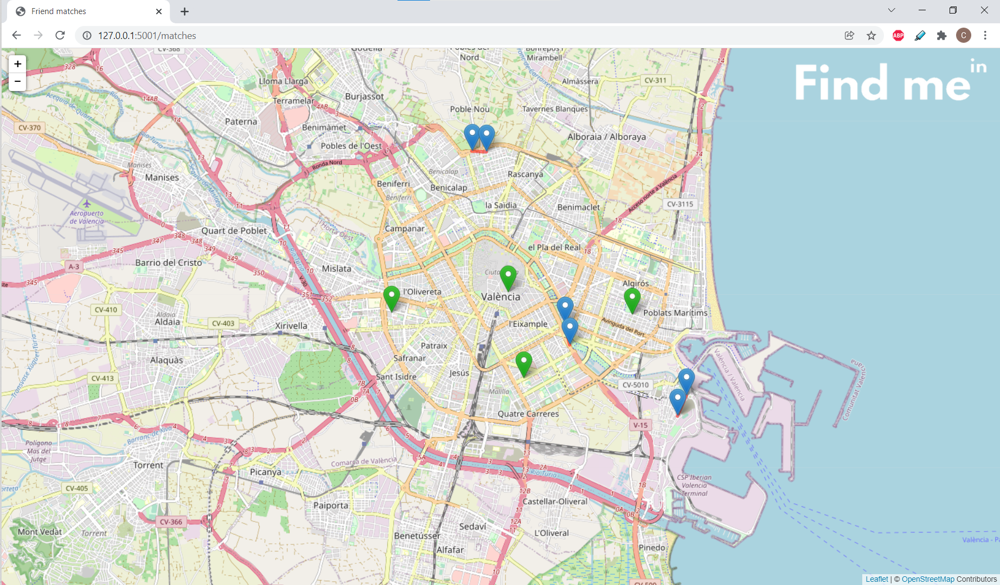
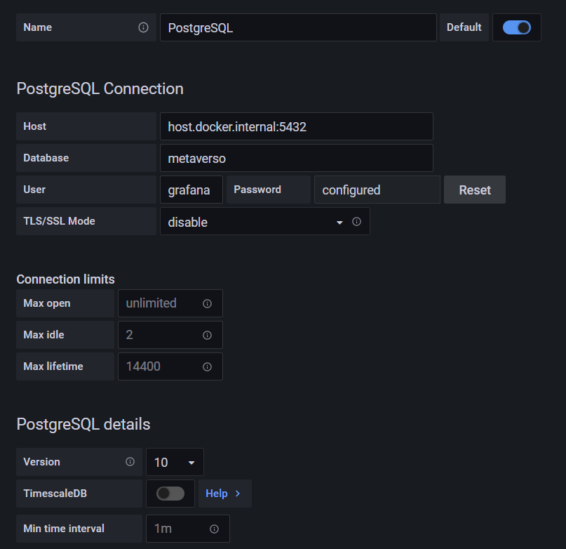
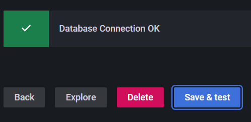
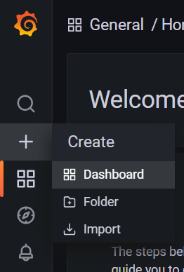

<p align="center">
   
</p>

Data Project 1 - Master Data Analytics EDEM

Grupo 4 - Caso 1 - Metaverso

Equipo:
- Enrique Badenas Cazorla
- Ramón Casans Camp
- Cristian Medina Azorín
- Hermán Redondo Lázaro
- Galo Valle GarcÍa


## Estructura del proyecto:
```bash
G4_DP1/
│   README.md
│   requirements.txt
│           
├───connection                         # Información relacionada con la conexión a base de datos
│       db_postgres.py                 # Script de conexión a PostgreSQL
│       docker-postgres.txt            # Información interna de ejecución
│       
├───docker                             # Contenedores de docker necesarios
│   ├───docker-grafana                 # Grafana
│   ├───docker-kafka-zookp             # Kafka + Zookeper
│   └───docker_postgres_with_data      # PostgreSQL
│       └───sql
│               create_tables.sql      # Instrucciones a ejecutar automáticamente durante la creación del contenedor
│               
├───images                             # Carpeta con imágenes utilizadas en el proyecto
│       
├───src                                # Código base del proyecto
│   │   consumer.py                    # Consumidor de mensajes. Implementa lógica de matches
│   │   producer.py                    # Generador de datos
│   │   upload_match.py                # Transforma y sube los matches a base de datos
│   │   upload_raw_data.py             # Transforma y sube los datos en crudo a base de datos
│   │   
│   └───leaflet_map_app         
│       │   app.py                     # Código flask para la visualización de los mapas
│       │   
│       └───templates
│               index.html             # Visualización de los datos en crudo (usuarios) en tiempo real
│               matches.html           # Visualización de los matches en tiempo real
│                
└───testing                            # Scripts de prueba (innecesario)                   

```


## Prerrequisitos:


1. Desde la consola, nos dirigimos a la carpeta donde deseamos clonar el repositorio y lo descargamos:
```console
git clone https://github.com/Enriquebadenas/G4_DP1.git
```
2. Abrimos el repositorio en el IDE que utilicemos (visual studio code, pycharm etc.) e instalamos las liberías necesarias:
```
pip install -r G4_DP1/requirements.txt
```
En caso de error, copiamos la ruta **absoluta** de requirements, en mi caso:
```
pip install -r  r'C:\Users\Cristian\Documents\repos\G4_DP1\requirements.txt'
```
### Kafka + Zookeper:
1. Nos dirigimos a la ruta donde se encuentre kafka-zookp-docker :
````
cd docker/docker-kafka-zookp
````
2. Ejecutamos:
```
docker-compose -f docker-compose-expose.yml up
```
Si todo ha ido bien, deberás ver un output similar a este:



### Conectar con base de datos:

1. Nos dirigimos a la carpeta docker\docker_postgres_with_data
```
cd G4_DP1\docker\docker_postgres_with_data
```

2. Ejecutamos el siguiente comando para levantar el contenedor de base de datos: 
````
docker-compose up
````
El contenedor se inicializa automáticamente creando las dos tablas PostgreSQL, raw_data y matches, indicado en ../sql/create_tables.sql:


3. En este punto ya tenemos acceso desde la clase "bbdd" del script connection/db_postgres.py (Actualmente no cuenta con ninguna tabla, ver más adelante como crearla desde el inicio). Podemos comprobar su comportamiento accediendo al contenedor. Para ello, buscamos el id del contenedor:
````
docker ps
````
4. **Localizamos el identificador del contenedor** (con los tres primeros dígitos es suficiente) y ejecutamos:
```
docker exec -it 3id bin/bash
```
También nos es posible acceder utilizando Docker Desktop:

5. Finalmente accedemos a la base de datos ejecutando:
```
psql -U root -d metaverso
```
6. Podemos realizar consultas sobre la base de datos para comprobar que todo se está subiendo correctamente.

### Ejecutar el proyecto:

Una vez que contamos con los contenedores referentes a kafka y a PostgreSQL corriendo, podemos pasar a ejecutar las partes del proyecto.

1. En primer lugar, ejcutamos el script _producer_. El objetivo de este script es generar los datos y enviarlos a un topic de Kafka llamado _generator_. Podemos ejecutar el script mediante el IDE que estemos utilizando o bien mediante consola. Para ello, nos situamos en la carpeta _src_ y ejecutamos:

```
python producer.py
```

Una vez que se encuentre bajo ejecución, observaremos un output similar al siguiente:


2. En segundo lugar, ejecutaremos el script _upload_raw_data.py_, el cual leerá del topic _generator_, transformará los mensajes a formato tabular y los almacenará en la tabla _raw_data_.

3. Tras esto, podemos ejecutar el script _consumer.py_, el cual contiene toda la lógica para calcular los matches entre amigos. Lee los datos del topic _generator_, calcula los matches y transmite el resultado al topic _matches_

4. Por último, ejecutamos el script _upload_match.py_, el cual se encarga de captar todos los mensajes del topic _matches_, tranformar los datos y subirlos a su tabla correspondiente en base de datos _matches_

5. Para comprobar que todo ha funcionado, accedemos a base de datos siguiendo los pasos explicados en el apartado anterior. Ejecutamos los comandos:
```
SELECT * FROM raw_data;
```


````
SELECT * FROM matches;
````


### Visualización del mapa en tiempo real:

Una vez que todas las partes anteriores se encuentren en ejecución, podemos pasar a visualizar el mapa con los diferentes usuarios. Para ello, necesitamos ejecutar el script _app.py_ ubicado en:

```
src/leaflet_map_app/app.py
```
y abrir el navegador introduciendo la siguiente ruta:
```
localhost:5001
```
#### Visualización web:
Tenemos dos opciones de visualización: 
* Visualización de usuarios activos.
* Visualización de matches.

Para poder generar ambas vistas, es necesario completar los pasos previos de ejecución del proyecto. Ejecutamos el archivo indistintamente por consola o mediante el IDE:
```
src/leaflet_map_app/app.py
```

En este punto ambas páginas se encuentran operativas, y podemos acceder a ellas para observar la visualización en tiempo real con:

* Visualización de usuarios activos:
```
http://127.0.0.1:5001/
```

* Visualización de matches:
```
http://127.0.0.1:5001/matches
```

### Grafana:
1. Para correr grafana, en primer lugar debemos descargarnos la imagen:
````
docker run -d --name=grafana -p 3000:3000 grafana/grafana
````
2. Una vez que el contenedor este corriendo, podemos acceder a grafana introduciendo en el navegador la siguiente ruta:
```
localhost:3000
```
3. Para acceder por primera vez, debemos introducir _admin_ tanto en usuario como en contraseña. Posteriormente, se nos pedirá que cambiemos la contraseña.

4. A continuación, debemos conectar grafana a la base de datos. Para ello, rellenaremos los datos de la siguiente forma:
* Host:  host.docker.internal:5432
* Databse: metaverso
* User: grafana
* Password: metaverso
* TLS/SSL Mode: disable
* Version: 10

Presionamos en **Save & Test**. Si todo ha funcionado correctamente, veremos el siguiente mensaje:

5. En este punto ya podemos realizar las visualizaciones que deseemos en la pestaña **dashboard**:

